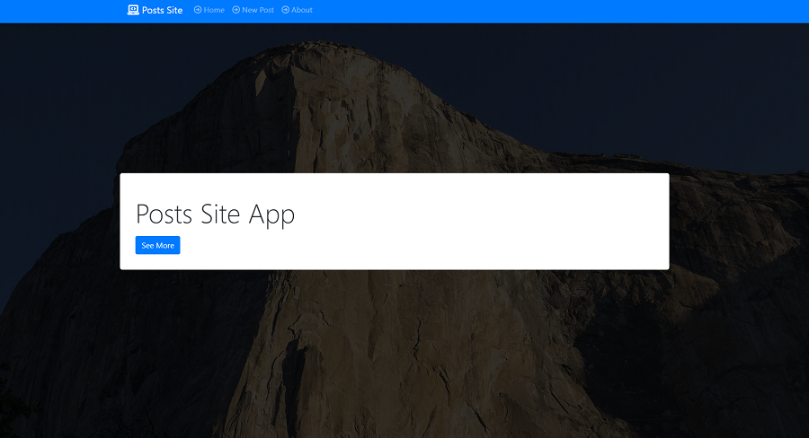

# Posts-Blog in Node.js
Posts-Blog is a simple CRUD app. It was created for mobile and desktop views. One can add, remove, edit, or show
specific post. This Website is deployed on Heroku.

## Author
- Dariusz Okonski

## Technologies 
- JavaScript
- Node
- Express
- MongoDb
- Mongoose
- Bootstrap

Application is hosted on heroku, so it can take few seconds to start: https://node-005-post-blog.herokuapp.com/
